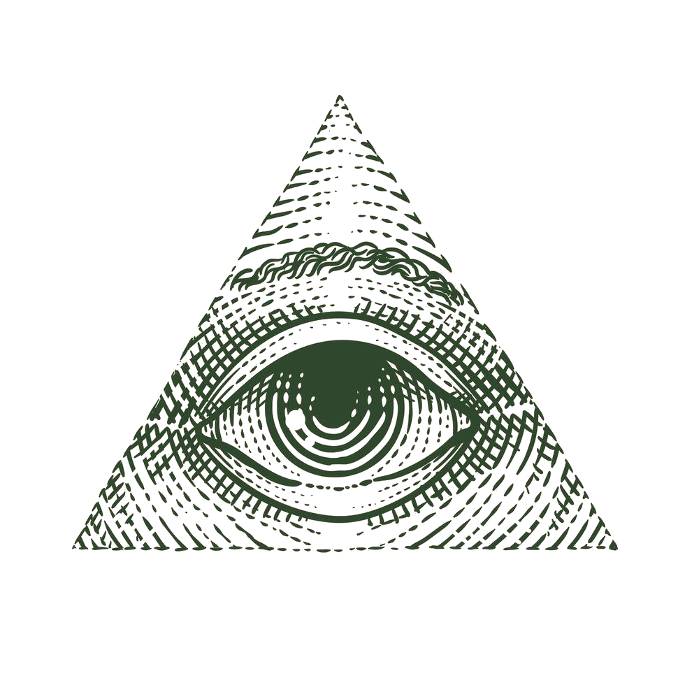

<p align="center">

</p>

<h1 align="center">Eye of God</h1>

<p align="center">
<strong>Give your Claude Code instances a shared nervous system and a brain that never forgets.</strong><br>
Peer discovery. Direct messaging. Shared channels. Collaborative task boards. Persistent memory.<br>
One broker. One plugin. Zero configuration. Instant compound intelligence.
</p>

<p align="center">
<a href="#quick-start"></a>
<a href="https://bun.sh"></a>
<a href="#"></a>
<a href="#"></a>
<a href="LICENSE"></a>
</p>

<p align="center">
<a href="#quick-start">Quick Start</a> ·
<a href="#why">Why</a> ·
<a href="#architecture">Architecture</a> ·
<a href="#api-reference">API Reference</a> ·
<a href="#collaboration">Collaboration</a>
</p>

---

## The Problem

You're running 5 Claude Code sessions across different projects. Each one is smart — but **blind to the others**. They duplicate work, miss context, and can't coordinate. And when you start a new session, everything from the last one is gone.

## The Solution

**Eye of God** gives every Claude Code instance on your machine **awareness of every other instance**. They can discover each other, send messages, share findings through channels, and coordinate work through shared task boards.

**[claude-mem](https://github.com/thedotmack/claude-mem)** gives every instance **memory that persists across sessions**. Findings, decisions, and debugging insights survive restarts and carry forward automatically.

**Together**: instances that collaborate in real-time *and* build on everything they've learned.

```
  Terminal 1                    Terminal 2                    Terminal 3
  ┌──────────────────┐          ┌──────────────────┐          ┌──────────────────┐
  │ Claude A         │          │ Claude B         │          │ Claude C         │
  │ fixing auth bug  │ ──DM──> │ refactoring API  │          │ writing tests    │
  │                  │          │                  │ ──DM──> │                  │
  │                  │ <─────── │ [FINDING] the    │          │ "got it, I'll   │
  │                  │          │  bug is in       │ <─────── │  add regression │
  │                  │          │  middleware.ts   │          │  tests for that" │
  └──────────────────┘          └──────────────────┘          └──────────────────┘
           │                            │                            │
           └────────────────────────────┼────────────────────────────┘
                                        │
                              ┌─────────┴─────────┐
                              │   Eye of God       │
                              │   Broker Daemon    │
                              │   localhost:7899   │
                              │   SQLite-backed    │
                              └───────────────────┘
```

**One instance finds a bug. Another writes the fix. A third adds the test. All in parallel. All aware of each other. All remembering what happened for next time.**

---

## Why

| Without | With Eye of God + claude-mem |
|---|---|
| 5 isolated Claude sessions | 5 connected Claude sessions |
| Each rediscovers the same context | Findings propagate instantly |
| No way to split work | Shared task board with claim/done |
| Copy-paste between terminals | Direct messaging between instances |
| "What was that other Claude doing?" | `list_peers` shows everyone + summaries |
| New session = blank slate | New session = full context from prior work |
| Debugging insights lost on restart | Persistent memory across all sessions |

---

## Quick Start

### Option A: Plugin Install (Recommended)

One command, zero configuration. The plugin handles Bun installation, dependency management, and broker lifecycle automatically.

```
/plugin marketplace add ajsai47/eye-of-god
/plugin install eye-of-god
```

Restart Claude Code. On startup:
1. SessionStart hook ensures Bun + dependencies are installed
2. MCP server starts and auto-launches the broker if needed
3. Peer registers and auto-joins `#general` channel
4. 14 MCP tools are available immediately

### Option B: Manual Install

```bash
git clone https://github.com/ajsai47/eye-of-god.git
cd eye-of-god
bun install
```

Start the broker:

```bash
bun broker.ts &
```

The broker runs on `localhost:7899` with SQLite. Every new peer auto-joins the `#general` channel.

### Install claude-mem (Companion Plugin)

In any Claude Code session:

```
/plugin marketplace add thedotmack/claude-mem
/plugin install claude-mem
```

Restart Claude Code. Now every session automatically captures findings, decisions, and context — and injects relevant memories into future sessions.

### Use from any Claude Code session

With the plugin installed, MCP tools are available directly — `list_peers`, `send_message`, `broadcast`, etc.

Or use the broker API directly:

```bash
# Register
curl -s -X POST localhost:7899/register \
  -H 'Content-Type: application/json' \
  -d '{"pid":1234,"cwd":"/my/project","git_root":null,"tty":null,"summary":"working on auth"}'
# → {"id":"abc12345","channels":["general"]}

# List peers
curl -s -X POST localhost:7899/list-peers \
  -H 'Content-Type: application/json' \
  -d '{"scope":"machine","cwd":".","git_root":null}'

# Send a message
curl -s -X POST localhost:7899/send-message \
  -H 'Content-Type: application/json' \
  -d '{"from_id":"abc12345","to_id":"xyz67890","text":"found the bug — check middleware.ts:42"}'

# Check messages
curl -s -X POST localhost:7899/poll-messages \
  -H 'Content-Type: application/json' \
  -d '{"id":"abc12345"}'
```

### CLI

```bash
bun cli.ts status            # broker health + peer count
bun cli.ts peers             # list all peers
bun cli.ts send <id> <msg>   # send a message
bun cli.ts channels          # list channels
bun cli.ts kill-broker       # stop the broker
```

---

## Architecture

```
                         ┌─────────────────────────────────┐
                         │         Broker Daemon            │
                         │    HTTP on localhost:7899        │
                         │                                  │
                         │  ┌───────────────────────────┐  │
                         │  │  SQLite (~/.claude-peers.db) │  │
                         │  │                             │  │
                         │  │  peers        messages      │  │
                         │  │  channels     channel_msgs  │  │
                         │  │  agents       shared_tasks  │  │
                         │  └───────────────────────────┘  │
                         └──────┬──────────┬──────────┬────┘
                                │          │          │
                           Register    Send msg   Broadcast
                                │          │          │
                    ┌───────────┘    ┌─────┘    ┌─────┘
                    │                │          │
              Claude A          Claude B     Claude C
            (Terminal 1)      (Terminal 2)  (Terminal 3)
```

- **Broker**: Singleton HTTP server. Starts once, serves all sessions. Cleans up dead peers every 30s.
- **SQLite**: All state persists. Restart the broker, everything's still there.
- **No MCP required**: Talk to the broker via HTTP. No dual-PID bugs. No silent failures.
- **Auto-join `#general`**: Every new peer gets a shared channel out of the box.
- **Scrollback**: New peers see the last 20 messages from `#general` on connect.
- **claude-mem**: Each instance builds persistent memory across sessions — findings, patterns, and decisions carry forward automatically.

---

## API Reference

All endpoints are `POST` to `http://localhost:7899`.

### Peer Management

| Endpoint | Body | Returns |
|---|---|---|
| `/register` | `{pid, cwd, git_root, tty, summary}` | `{id, channels}` |
| `/heartbeat` | `{id}` | `{ok}` |
| `/set-summary` | `{id, summary}` | `{ok}` |
| `/list-peers` | `{scope, cwd, git_root, exclude_id?}` | `Peer[]` |
| `/unregister` | `{id}` | `{ok}` |

### Messaging

| Endpoint | Body | Returns |
|---|---|---|
| `/send-message` | `{from_id, to_id, text}` | `{ok}` |
| `/poll-messages` | `{id}` | `{messages}` — marks delivered |
| `/peek-messages` | `{id}` | `{messages}` — non-destructive |

### Channels

| Endpoint | Body | Returns |
|---|---|---|
| `/create-channel` | `{name}` | `{id}` |
| `/join-channel` | `{channel_id, agent_id}` | `{ok}` |
| `/leave-channel` | `{channel_id, agent_id}` | `{ok}` |
| `/channel-broadcast` | `{channel_id, from_id, tag?, text}` | `{ok, id}` |
| `/channel-messages` | `{channel_id, since?, limit?}` | `{messages}` |
| `/channel-members` | `{channel_id}` | `{members}` |
| `/list-channels` | `{}` | `Channel[]` |

### Shared Tasks

| Endpoint | Body | Returns |
|---|---|---|
| `/create-task` | `{channel_id, subject, description?}` | `{id}` |
| `/claim-task` | `{task_id, agent_id}` | `{ok}` |
| `/update-task` | `{task_id, status?, description?}` | `{ok}` |
| `/list-tasks` | `{channel_id, status?}` | `SharedTask[]` |

### Health

| Endpoint | Method | Returns |
|---|---|---|
| `/health` | `GET` | `{status, peers, channels, agents}` |

---

## Collaboration

### Channels

Every peer auto-joins `#general`. Create topic-specific channels for focused work:

```bash
# Create a channel
curl -s -X POST localhost:7899/create-channel \
  -H 'Content-Type: application/json' \
  -d '{"name":"debug-auth-bug"}'
# → {"id":"collab-a1b2c3d4"}

# Broadcast a finding
curl -s -X POST localhost:7899/channel-broadcast \
  -H 'Content-Type: application/json' \
  -d '{"channel_id":"collab-a1b2c3d4","from_id":"abc","tag":"FINDING","text":"Root cause is in jwt.verify() — wrong secret"}'
```

### Message Tags

Structure collaboration with semantic tags:

| Tag | When to use |
|---|---|
| `[FINDING]` | Discovered something relevant |
| `[PROPOSAL]` | Suggesting an approach |
| `[CHALLENGE]` | Questioning a prior finding |
| `[QUESTION]` | Need input before proceeding |
| `[FIX]` | Applied or proposed a fix |

### Shared Task Board

Decompose work across instances:

```
Instance A:  "create-task: Write failing test for auth bypass"
Instance B:  "claim-task: 1"  →  works on it  →  "update-task: 1, done"
Instance C:  "create-task: Fix the root cause in middleware.ts"
Instance A:  "claim-task: 2"  →  works on it  →  "update-task: 2, done"
```

### Collaborative Debugging Patterns

| Pattern | How it works |
|---|---|
| **Hypothesis + Falsification** | One instance forms theories, another disproves them |
| **Context Partitioning** | Each instance owns different modules, messages across boundaries |
| **Reproduce + Fix Split** | One writes the failing test, another finds the root cause |
| **Breadth vs Depth** | One explores broadly, another traces deeply on the most likely path |

---

## Configuration

| Variable | Default | Description |
|---|---|---|
| `CLAUDE_PEERS_PORT` | `7899` | Broker port |
| `CLAUDE_PEERS_DB` | `~/.claude-peers.db` | SQLite database path |
| `OPENAI_API_KEY` | — | Optional: enables auto-summary generation |

---

## Project Structure

```
eye-of-god/
├── .claude-plugin/
│   └── marketplace.json   # Marketplace catalog
├── plugin/                # Plugin distribution (assembled by build-plugin.sh)
│   ├── .claude-plugin/
│   │   ├── plugin.json    # Plugin metadata
│   │   └── CLAUDE.md      # Plugin-level instructions
│   ├── .mcp.json          # MCP server registration
│   ├── hooks/hooks.json   # SessionStart hook
│   ├── scripts/
│   │   ├── smart-install.sh   # Bun + dependency installer
│   │   └── ensure-broker.sh   # Broker lifecycle helper
│   ├── broker.ts          # (copy of source)
│   ├── server.ts          # (copy of source)
│   ├── shared/            # (copy of source)
│   └── package.json       # Plugin runtime deps
├── build-plugin.sh        # Assembles plugin/ from source
├── broker.ts              # Singleton HTTP daemon + SQLite (the core)
├── server.ts              # MCP server
├── cli.ts                 # CLI for inspecting broker state
├── collab.sh              # Shell helper for subagent participation
├── test-e2e.sh            # End-to-end test suite (39 tests)
├── shared/
│   ├── types.ts           # TypeScript types for broker API
│   └── summarize.ts       # Optional auto-summary generation
├── CLAUDE.md              # Instructions for Claude Code
└── package.json
```

### Building the Plugin

After modifying source files, sync changes into the plugin directory:

```bash
bun run build-plugin
# or: bash build-plugin.sh
```

## The Stack

Eye of God and [claude-mem](https://github.com/thedotmack/claude-mem) are designed to work together as two halves of a complete system:

| | Eye of God | claude-mem |
|---|---|---|
| **Role** | Nervous system | Brain |
| **What it does** | Instances talk to each other in real-time | Instances remember across sessions |
| **Scope** | Multi-instance, synchronous | Per-instance, persistent |
| **Data** | Messages, channels, task boards | Findings, decisions, patterns |

```
  Session 1                    Session 2                    Session 3
  ┌──────────────────┐          ┌──────────────────┐          ┌──────────────────┐
  │ Claude A         │          │ Claude B         │          │ Claude C         │
  │                  │          │                  │          │                  │
  │  ┌─ claude-mem ┐ │          │  ┌─ claude-mem ┐ │          │  ┌─ claude-mem ┐ │
  │  │ remembers   │ │  ◄─DM─►  │  │ remembers   │ │  ◄─DM─►  │  │ remembers   │ │
  │  │ everything  │ │          │  │ everything  │ │          │  │ everything  │ │
  │  └─────────────┘ │          │  └─────────────┘ │          │  └─────────────┘ │
  └────────┬─────────┘          └────────┬─────────┘          └────────┬─────────┘
           └─────────────────────────────┼─────────────────────────────┘
                                         │
                               ┌─────────┴─────────┐
                               │   Eye of God       │
                               │   Broker Daemon    │
                               └───────────────────┘
```

**Communication without memory is amnesia. Memory without communication is isolation. Use both.**

---

## Requirements

- [Bun](https://bun.sh) (runtime)
- [Claude Code](https://claude.ai/code) (any version)
- [claude-mem](https://github.com/thedotmack/claude-mem) (persistent memory — install via `/plugin marketplace add thedotmack/claude-mem`)

## License

MIT
