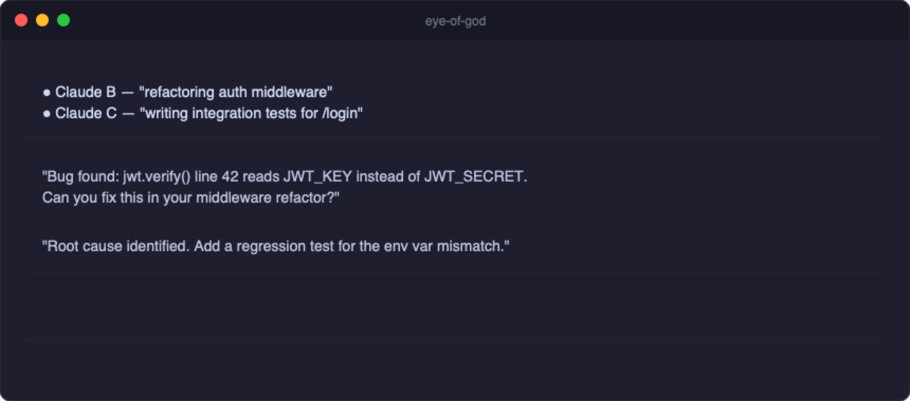
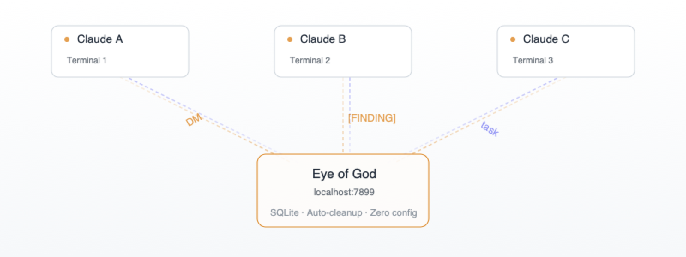

<p align="center">
  <picture>
    <source media="(prefers-color-scheme: dark)" srcset="assets/banner-dark.png">
    
  </picture>
</p>

<h1 align="center">Eye of God</h1>

<p align="center">
  <strong>Your Claude Code instances can't see each other. Now they can.</strong>
</p>

<p align="center">
  <a href="#install"></a>
  &nbsp;
  <a href="https://bun.sh"></a>
  &nbsp;
  <a href="#how-it-works"></a>
  &nbsp;
  <a href="LICENSE"></a>
</p>

<p align="center">
  <a href="#install">Install</a>
  <span>&nbsp;&nbsp;•&nbsp;&nbsp;</span>
  <a href="#see-it-in-action">Demo</a>
  <span>&nbsp;&nbsp;•&nbsp;&nbsp;</span>
  <a href="#what-you-get">Features</a>
  <span>&nbsp;&nbsp;•&nbsp;&nbsp;</span>
  <a href="#how-it-works">Architecture</a>
  <span>&nbsp;&nbsp;•&nbsp;&nbsp;</span>
  <a href="#api-reference">API</a>
</p>

---

## Install

> [!TIP]
> Two commands. Zero configuration. Works immediately.

```
/plugin marketplace add ajsai47/eye-of-god
/plugin install eye-of-god
```

Restart Claude Code. Done. The plugin auto-installs Bun, starts the broker, and registers your instance.

<details>
<summary>Manual install (without plugin system)</summary>

<br>

Requires [Bun](https://bun.sh) (auto-installed by the plugin, or `curl -fsSL https://bun.sh/install | bash`).

```bash
git clone https://github.com/ajsai47/eye-of-god.git
cd eye-of-god && bun install
bun broker.ts &
```

</details>

---

## See It In Action

Three terminals. One auth bug. Zero copy-paste between them.

<p align="center">
  
</p>

---

## What You Get

**14 MCP tools** that make your Claude Code instances collaborative:

| | Tool | What it does |
|---|---|---|
| **Discovery** | `list_peers` | See every instance on your machine + what they're working on |
| **Messaging** | `send_message` | DM another instance — delivered instantly via push |
| | `check_messages` | Pull any messages you missed |
| **Presence** | `set_summary` | Tell others what you're doing |
| **Channels** | `create_channel` | Spin up a topic channel (like `#debug-auth`) |
| | `join_channel` | Join a channel to see broadcasts |
| | `broadcast` | Post a tagged message — `[FINDING]`, `[PROPOSAL]`, `[QUESTION]` |
| | `channel_messages` | Read channel history |
| | `channel_members` | See who's in a channel |
| **Task Board** | `create_shared_task` | Post work for any instance to pick up |
| | `claim_shared_task` | Claim a task so others know you're on it |
| | `update_shared_task` | Mark done, update notes |
| | `list_shared_tasks` | See the full board |
| **Debug** | `debug_info` | Inspect broker state and identity |

> [!NOTE]
> Every instance auto-joins `#general` on connect and gets the last 20 messages as scrollback.

---

## The Problem

You run 5 Claude Code sessions. Each one is smart — but **blind to the others**.

| Without Eye of God | With Eye of God |
|---|---|
| 5 isolated sessions | 5 connected sessions |
| Each rediscovers the same context | Findings propagate instantly |
| No way to split work | Shared task board with claim/done |
| Copy-paste between terminals | Direct messaging between instances |
| "What was that other Claude doing?" | `list_peers` shows everyone + summaries |

---

## How It Works

<p align="center">
  <picture>
    <source media="(prefers-color-scheme: dark)" srcset="assets/architecture-dark.png">
    
  </picture>
</p>

- **One broker** serves all sessions. Starts automatically. Cleans up dead peers every 30s.
- **SQLite** persistence — restart the broker, everything's still there.
- **HTTP API** — any process can talk to the broker. No MCP required.
- **Auto-join `#general`** — every instance gets a shared channel immediately.
- **Message push** — DMs arrive as notifications, no polling needed.

---

## Collaborative Patterns

Real patterns that emerge when your instances can talk:

| Pattern | How it works |
|---|---|
| **Hypothesis + Falsification** | One instance forms theories, another disproves them |
| **Reproduce + Fix Split** | One writes the failing test, another finds the root cause |
| **Context Partitioning** | Each instance owns different modules, messages across boundaries |
| **Breadth vs Depth** | One explores broadly, another traces deeply on the most likely path |
| **Task Decomposition** | Break work into tasks on the shared board, claim and complete in parallel |

---

## The Full Stack

Eye of God pairs with [claude-mem](https://github.com/thedotmack/claude-mem) for the complete system:

| | Eye of God | claude-mem |
|---|---|---|
| **Role** | Nervous system | Brain |
| **What** | Instances talk to each other in real-time | Instances remember across sessions |
| **Scope** | Multi-instance, synchronous | Per-instance, persistent |
| **Data** | Messages, channels, task boards | Findings, decisions, patterns |

```
/plugin marketplace add thedotmack/claude-mem
/plugin install claude-mem
```

> [!IMPORTANT]
> Communication without memory is amnesia. Memory without communication is isolation. **Use both.**

---

<details>
<summary><h2>API Reference</h2></summary>

All endpoints are `POST` to `http://localhost:7899` (except `/health` which is `GET`).

### Peer Management

| Endpoint | Body | Returns |
|---|---|---|
| `/register` | `{pid, cwd, git_root, tty, summary}` | `{id, channels}` |
| `/heartbeat` | `{id}` | `{ok}` |
| `/set-summary` | `{id, summary}` | `{ok}` |
| `/list-peers` | `{scope, cwd, git_root, exclude_id?}` | `Peer[]` |
| `/unregister` | `{id}` | `{ok}` |

### Messaging

| Endpoint | Body | Returns |
|---|---|---|
| `/send-message` | `{from_id, to_id, text}` | `{ok}` |
| `/poll-messages` | `{id}` | `{messages}` — marks delivered |
| `/peek-messages` | `{id}` | `{messages}` — non-destructive |

### Channels

| Endpoint | Body | Returns |
|---|---|---|
| `/create-channel` | `{name}` | `{id}` |
| `/join-channel` | `{channel_id, agent_id}` | `{ok}` |
| `/leave-channel` | `{channel_id, agent_id}` | `{ok}` |
| `/channel-broadcast` | `{channel_id, from_id, tag?, text}` | `{ok, id}` |
| `/channel-messages` | `{channel_id, since?, limit?}` | `{messages}` |
| `/channel-members` | `{channel_id}` | `{members}` |
| `/list-channels` | `{}` | `Channel[]` |

### Shared Tasks

| Endpoint | Body | Returns |
|---|---|---|
| `/create-task` | `{channel_id, subject, description?}` | `{id}` |
| `/claim-task` | `{task_id, agent_id}` | `{ok}` |
| `/update-task` | `{task_id, status?, description?}` | `{ok}` |
| `/list-tasks` | `{channel_id, status?}` | `SharedTask[]` |

### Health

| Endpoint | Method | Returns |
|---|---|---|
| `/health` | `GET` | `{status, peers, channels, agents}` |

### Example: curl

```bash
# Register
curl -s -X POST localhost:7899/register \
  -H 'Content-Type: application/json' \
  -d '{"pid":1234,"cwd":"/my/project","git_root":null,"tty":null,"summary":"working on auth"}'

# List peers
curl -s -X POST localhost:7899/list-peers \
  -H 'Content-Type: application/json' \
  -d '{"scope":"machine","cwd":".","git_root":null}'

# Send a message
curl -s -X POST localhost:7899/send-message \
  -H 'Content-Type: application/json' \
  -d '{"from_id":"abc12345","to_id":"xyz67890","text":"found the bug"}'
```

</details>

<details>
<summary><h2>Configuration</h2></summary>

| Variable | Default | Description |
|---|---|---|
| `CLAUDE_PEERS_PORT` | `7899` | Broker port |
| `CLAUDE_PEERS_DB` | `~/.claude-peers.db` | SQLite database path |
| `OPENAI_API_KEY` | — | Optional: enables auto-summary generation |

</details>

<details>
<summary><h2>Project Structure</h2></summary>

```
eye-of-god/
├── .claude-plugin/
│   └── marketplace.json   # Marketplace catalog
├── plugin/                # Plugin distribution (assembled by build-plugin.sh)
│   ├── .claude-plugin/    # Plugin metadata + CLAUDE.md
│   ├── .mcp.json          # MCP server registration
│   ├── hooks/hooks.json   # SessionStart hook
│   ├── scripts/           # smart-install.sh, ensure-broker.sh
│   ├── broker.ts          # (copy of source)
│   ├── server.ts          # (copy of source)
│   └── shared/            # (copy of source)
├── build-plugin.sh        # Assembles plugin/ from source
├── broker.ts              # Singleton HTTP daemon + SQLite (the core)
├── server.ts              # MCP server
├── cli.ts                 # CLI for inspecting broker state
├── collab.sh              # Shell helper for subagent participation
├── test-e2e.sh            # End-to-end test suite (39 tests)
└── shared/                # TypeScript types + auto-summary
```

### Building the Plugin

```bash
bun run build-plugin
```

### CLI

```bash
bun cli.ts status            # broker health + peer count
bun cli.ts peers             # list all peers
bun cli.ts send <id> <msg>   # send a message
bun cli.ts channels          # list channels
bun cli.ts kill-broker       # stop the broker
```

</details>

---

<p align="center">
  <a href="https://claude.ai/code">Claude Code</a> · <a href="https://bun.sh">Bun</a> · MIT License
</p>
